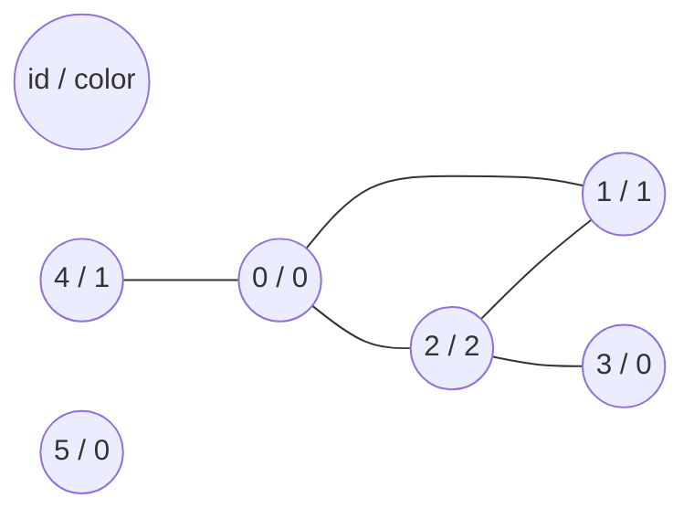

## Graph coloring
Coloring the graph using the greedy method.

### Input:

    p
    n
    k x_1 x_2 ... x_k     <--- id = 0
    k_1 x_1 x_2 .. x_k1   <--- id = 1
    .
    .
    k_n x_1 x_2 .. x_k(n) <--- id = n-1

|p| Algorithm |
|--|--|
| 0 | coloring from k to k_n |
| 1 | LF algorithm (largest first) |

n - number of vertices\
k - number of adjacent vertices\
x_1 x_2 ... x_k - ids of vertices\

### Output:

    m
    id - color (n times)

m - number of used colors (in the greedy method this number is suboptimal)\
id - id of vertex\
color - integer number (lowest color = 0)\

##### Example input:
    
    0           <--- mode
    6           <--- number of vertices
    3 1 2 4     <--- vertex with id = 0, that has 3 neighbours: 1, 2, 4
    2 0 2       <--- vertex with id = 1, that has 2 neighbours: 0, 2
    3 0 1 3     
    1 2
    1 0
    0           <-- vertex with id = 5, that has 0 neighbours

##### Example output:

    3
    0 - 0
    1 - 1
    2 - 2
    3 - 0
    4 - 1
    5 - 0

##### Graph of sample input:

